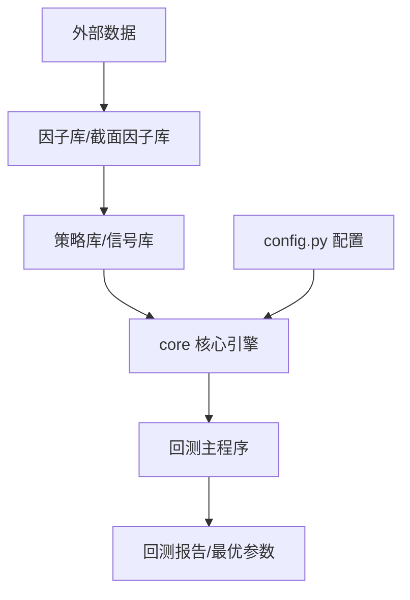

## 第一阶段：结构与功能全景分析

**目的：** 让 AI 理解每个文件夹和核心文件的职责，并梳理代码调用关系。

> 提示词：
>
> “我正在开发/维护一个名为 Python 量化回测框架。以下是其目录结构：
>
> 1. `core/`: 核心引擎
> 2. `策略库/` & `信号库/`: 逻辑实现
> 3. `因子库/` & `截面因子库/`: 因子
> 4. `回测主程序.py` & `寻找最优参数.py`: 执行入口
>
> 请你扮演资深量化分析师和系统架构师。我将为你依次上传这些核心文件的内容，请你先根据目录结构，推测并描述该框架的**数据流向**（从外部数据到最终回测报告的过程）以及各模块间的**耦合关系**。请以技术文档的口吻进行概述。”
>
> 输出到 结构与功能全景分析.md

------

## 第二阶段：核心模块深度解析与文档化

**目的：** 针对核心逻辑（如 `core` 和 `回测主程序.py`）生成详细的开发者文档。

> 提示词：
>
> “现在，请你详细分析 core/ 文件夹下的核心类和 回测主程序.py(backtest.py)。请输出一套完整的技术文档库，包含以下内容：
>
> 1. **功能描述**：该模块解决了什么问题？
>
> 2. **核心函数/类清单**：输入参数、输出结果、算法逻辑（用 Markdown 表格展示）。
>
> 3. **异常处理机制**：代码中是如何处理数据缺失或计算错误的？
>
> 4. **优化建议**：从性能（如多进程）或量化逻辑（如未来函数检测）角度给出改进点。”
>
>    输出到 核心模块深度解析与文档化.md

------

## 第三阶段：架构可视化（AI 绘图提示词生成）

**目的：** 让 AI 生成用于绘制架构图、流程图的提示词（适用于 Mermaid 或 Midjourney/DALL-E）。

> 提示词：
>
> “基于你对该框架的理解，请为我生成以下两类绘图提示词：
>
> 1. **Mermaid.js 代码**：生成一个流程图代码，描述从‘外部数据导入’到‘因子计算’再到‘回测生成报告’的逻辑全过程，要求放入 Markdown 块中。
> 2. **AI 绘画描述词 (Prompt)**：基于附件文档（结构与功能全景分析，核心模块深度解析与文档化），给我一套架构可视化的  AI生图提示词，越详细越好 。”

------

### 示例 Mermaid 逻辑结构预览

Code snippet

